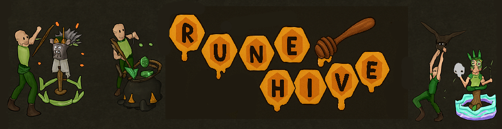

<div align="center">



**RuneScape 2 Protocol #317 (June 13, 2005)**  
*Loading Old School RuneScape #214 Cache Data*

[RuneHive Website](https://www.runehive.com/) 
</div>

## DISCLAIMER
> **RuneHive** is an **educational prototype** created to study Java game server–client architecture. It is **not affiliated with, endorsed by, or sponsored by Jagex Ltd.** “RuneScape®” and “Old School RuneScape®” are **registered trademarks of Jagex Ltd.**
---

## CREDITS
```text
Jagex (2001)
├─ Andrew Gower · Paul Gower · Ian Gower
│
├──▶ Hyperion (2009)
│   ├─ Developers: Graham · blakeman8192 · BrettR
│   ├─ Key Traits:
│   │   • Non-blocking Netty I/O
│   │   • Entity-component system
│   │   • Separation of game logic vs protocol
│   └─ Influence: Foundation for modular RSPS design
│
├──▶ Apollo (2010–2012)
│   ├─ Developers: Graham · blakeman8192 · Sir Sean · Scu11 · Phyfiox
│   ├─ Key Traits:
│   │   • Advanced pathfinding algorithms
│   │   • Robust task scheduler
│   │   • Plugin-based gameplay modules
│   └─ Influence: Core inspiration for OS-Royale’s networking and pathfinding
│
├──▶ OS-Royale (2016)
│   ├─ Developers: Ashpire · Chex · Nshusa · S1ckman · RSPSSam · Owain · Zion
│   ├─ Key Traits:
│   │   • Hybrid of Hyperion + Apollo
│   │   • OSRS cache/data handling improvements
│   │   • Custom clan chat, combat, and plugin systems
│   └─ Influence: Direct parent to Tarnish
│
└──▶ Tarnish (2020s)
    ├─ Developers: Jire · Settings · Jack · Zion · Nighel · Muntuna
    ├─ Key Traits:
    │   • Kotlin + Java 21 modernization
    │   • Gradle 8 build system
    │   • OSRS 214 cache integration
    │   • Modular client–server architecture
    │   • Enhanced performance and maintainability
    └─ Influence: Modern evolution of OS-Royale
```
---
## CHANGELOG
 ### The format is based on [Keep a Changelog](https://keepachangelog.com/en/1.1.0/), and this project adheres to [Semantic Versioning](https://semver.org/spec/v2.0.0.html).
 ---

### [1.0.1] - 2025-10-06T04:30:00Z

#### Added

- **AI Integration System**: Complete OpenAI GPT-4o-mini integration for dynamic NPC dialogue and text-to-speech
  
  - **`AIDialogueHandler.java`**: AI-driven NPC conversation orchestrator
    - Extends `Dialogue` framework for seamless integration with existing dialogue system
    - Implements proximity-based validation (1-tile radius from NPC spawn at 1684,3746)
    - Integrates `DialogueCameraDirector` for cinematic camera choreography during AI conversations
    - Command-driven input via `::gpt <message>` for player-to-NPC interaction
    - Target NPC: Wise Old Man (ID: 2108) for AI-powered conversations
  
  - **`LazyAIManager.java`**: Lazy-initialization AI service lifecycle manager
    - Singleton pattern with thread-safe `AtomicBoolean` initialization guard
    - Session-based consent tracking via `ConcurrentHashMap.newKeySet()`
    - Inactivity timer management with `ConcurrentHashMap<String, Task>` for automatic session cleanup
    - Dual-service coordination: `OpenAIService` (dialogue) + `PiperTTSService` (voice synthesis)
    - On-demand initialization triggered only when player clicks AI-enabled NPC (ID: 2108)
    - Automatic player positioning 1 tile west of NPC with face-to-face orientation
    - Camera mode initialization: `BEHIND_PLAYER` for player-speaks-first choreography
  
  - **`OpenAIService.java`**: OpenAI API client with production-ready features
    - Official OpenAI Java SDK (`com.openai:openai-java:4.1.0`) with OkHttp transport
    - Thread pool executor (4 threads) for non-blocking async API requests via `CompletableFuture`
    - Conversation context management: `ConcurrentHashMap<String, List<ChatMessage>>` with 10-message history limit
    - Model configuration: GPT-4o-mini with 500 max tokens, 0.8 temperature for creative responses
    - API key loading hierarchy: (1) `OPENAI_API_KEY` env var → (2) `openai-java-key.txt` file fallback
    - Key format validation: enforces `sk-[a-zA-Z0-9\-_]{20,}` pattern with regex matching
    - Retry mechanism: 3 retries with 30-second timeout per request
    - Security logging: warns when file-based key used instead of environment variable
  
  - **`OpenAIRelayJob.java`**: Scheduled maintenance cron job for AI services
    - Extends `Job` framework for Quartz scheduler integration
    - Monitors active OpenAI conversation session count with debug logging
    - Triggers `PiperTTSService.cleanupOldFiles()` to prevent disk bloat
    - Conditional execution: skips processing when AI services not initialized (lazy pattern)
    - Debug telemetry: logs active session count for operational visibility

- **Enhanced Camera System**: Cinematic over-the-shoulder dialogue camera with scene-synchronized coordinate system
  
  - **`DialogueCameraDirector.java`**: Real-time camera choreography engine with persistent scene base tracking
    - **Architecture**: Two-mode system: `BEHIND_PLAYER` (player speaks) ↔ `BEHIND_NPC` (NPC responds)
    - **Update Loop**: Tick-based continuous updates with `regionChange` guard to skip during map transitions
    - **Coordinate System Fix**: Uses persisted scene base from `Player.sceneBaseChunkX/Y` instead of recomputing
      - **Root Cause**: Previously recomputed base each tick from `player.getPosition()`, causing drift from client's actual scene base
      - **Solution**: Scene base persisted when `SendMapRegion` packet sent, ensuring server/client alignment
      - **Result**: Eliminates "camera anchored at login tile" bug by using exact coordinate frame client expects
    - **Positional Math**: 1.7 tiles behind speaker + 0.6 tiles right shoulder offset (world coordinates)
    - **Coordinate Conversion**: `Player.toSceneLocalX/Y()` helpers convert world → scene-local using persisted base
    - **Elevation**: 220 units (packet 166) for eye-level positioning, 210 tilt (packet 177)
    - **Smooth Movement**: Constant-speed interpolation (18 move/20 turn base, 16/14 during swaps)
    - **Swap Boost System**: Temporary speed increase (8 ticks) during speaker transitions for snappier cuts
    - **Safety Mechanisms**: 
      - Guard: skip if scene base not set (`sceneBaseChunkX == 0 && sceneBaseChunkY == 0`)
      - Bounds validation: local coords must be within 0-104 tile viewport
      - Auto-reset on NPC death/despawn, graceful null handling
    - **State Machine**: `OFF` → `BEHIND_PLAYER` → `BEHIND_NPC` → `RESET_PENDING` → `OFF`
    - **2-Tick Delay**: Camera activation delayed 2 ticks after dialogue start to prevent coordinate misalignment
  
  - **`Player.java`**: Scene base persistence for camera coordinate system
    - **Fields**: `sceneBaseChunkX`, `sceneBaseChunkY` (transient) - client's current scene base in 8×8 chunks
    - **Accessors**: `getSceneBaseChunkX()`, `getSceneBaseChunkY()`, `setSceneBaseChunks(int, int)`
    - **Helpers**: `toSceneLocalX(int|Position)`, `toSceneLocalY(int|Position)` - world → scene-local conversion
    - **Purpose**: Guarantees camera packets use exact coordinate frame client received in `SendMapRegion`
  
  - **`SendMapRegion.java`**: Map region packet with scene base persistence (Packet 73)
    - **Computation**: `sceneBaseChunkX = (worldX >> 3) - 6`, `sceneBaseChunkY = (worldY >> 3) - 6`
    - **Persistence**: Calls `player.setSceneBaseChunks()` with computed values before sending packet
    - **Guarantee**: Server's camera coordinate frame matches client's exactly, no drift across region loads
    - **Debug Output**: `[MapRegion] sceneBaseChunks=(X,Y) tiles=(X*8,Y*8)` for verification
  
  - **`SendCameraMove.java`**: Client network packet for camera position updates (Packet 166)
    - **Payload**: `(byte x, byte y, short z, byte constantSpeed, byte variableSpeed)`
    - **Coordinate Space**: Scene-local tile coordinates (0-104 range) relative to persisted scene base
    - **Z-axis**: 16-bit short for vertical positioning (220 = eye-level standard)
    - **Speed Control**: Dual-parameter system (constant + variable) for distance-independent smooth motion
    - **Used By**: `DialogueCameraDirector.shoulderShot()` after converting world coords via `Player.toSceneLocalX/Y()`

- **Extended Network Protocol**: New client-server packet implementations
  - **`HintArrowClear.java`**: Packet to remove active hint arrow from client display
    - Simple packet with no payload, resets client-side hint arrow state
  
  - **`HintArrowTile.java`**: Packet to display red directional hint arrow at world coordinates
    - Payload: `Position` object with X/Y/Z coordinates
    - Guides players to specific tiles (quest objectives, AI NPCs, waypoints)
  
  - **`SendEnterText.java`**: Text input prompt packet for client-side dialog boxes
    - Used for dynamic player input during dialogues and interactions
    - Integrates with AI dialogue flow for free-form conversation input
- **OpenAI Dependency**: `com.openai:openai-java:4.1.0`

#### Changed
- **Package Namespace**: Complete refactoring from `com.osroyale` to `com.runehive`
  - All ~1,200 Java source files updated
  - Main class renamed: `OSRoyale.java` → `RuneHive.java`
- **Main Application Class**: `com.osroyale.OSRoyale` → `com.runehive.RuneHive`
- **Project Name**: "Tarnish" / "OS-Royale" → "RuneHive"
  - `build.gradle.kts`: mainClass updated to `com.runehive.RuneHive`
  - `settings.gradle.kts`: rootProject.name = "runehive-server"
  - `.iml` file: `os-royale-server.iml` → `runehive-server.iml`
- **Configuration Sanitization** (`settings.toml`):
  - `server_name`: "Tarnish" → "RuneHive"
  - `website_url`: Cleared 
  - `forum_db_url`: Cleared (was MySQL connection string)
  - `forum_db_user`: Cleared (was "osroyjs_game")
  - `forum_db_pass`: Cleared (was hashed password)
  - `discord.token`: Cleared (was active bot token)
- **Enhanced .gitignore**: Streamlined from 155 to 67 lines
  - Added: OpenAI security: `openai-java-key.txt`, `*.key`, `*.secret`, `*.env`, `*.token`
  - Added: `settings.toml` (prevents credential leaks)

#### Removed
- **Discord Integration**: Complete removal of Discord bot functionality
  - `com.osroyale.net.discord.BotListener.java`
  - `com.osroyale.net.discord.Constants.java`
  - `com.osroyale.net.discord.Discord.java`
  - `com.osroyale.net.discord.DiscordDispatcher.java`
  - `com.osroyale.net.discord.DiscordPlugin.java`
  - Dependency: `com.discord4j:discord4j-core:3.2.4`
  - Dependency: `net.dv8tion:JDA:5.0.0-beta.11`
- **External Service Integration**: Forum and website URLs cleared from config

#### Security
- **Credential Sanitization**: All sensitive credentials removed from `settings.toml`
  - Database passwords, forum credentials, Discord tokens cleared
  - `.gitignore` updated to prevent future credential commits
- **Secret Management**: Enhanced .gitignore for API keys and tokens
  - OpenAI API keys explicitly ignored
  - Generic patterns for `.key`, `.secret`, `.env`, `.token` files
- **Environment Variable Priority**: OpenAI API key loading (`OpenAIService.java`)
  - **Primary**: Loads from `OPENAI_API_KEY` environment variable (recommended)
  - **Fallback**: Reads from `openai-java-key.txt` file with security warning
  - **Validation**: Enforces `sk-[alphanumeric]{20+}` key format
  - **Best Practice**: Environment variable prevents credential exposure in version control

### [1.0.0] - 2025-10-06T04:30:00Z

```bash
git clone --depth 1 --filter=blob:none --sparse https://github.com/Jire/tarnish.git
cd tarnish
git sparse-checkout set game-server
```
The stock Tarnish game server (OSRoyale-based) has **robust SQL support** with:

 **Multiple database systems**: PostgreSQL (primary), MySQL (secondary services)  
 **Connection pooling**: HikariCP for performance optimization  
 **Comprehensive data persistence**: Players, items, skills, logs, achievements  
 **Structured logging**: All game events logged to PostgreSQL  
 **External integrations**: Forum authentication, donations, voting, highscores  
 **Conditional initialization**: Only runs in LIVE mode with FORUM_INTEGRATION enabled  

The implementation uses the **jcabi-jdbc** library for cleaner SQL operations and maintains separation between game data (PostgreSQL) and web services (MySQL).

---
#### Supported Database Systems

#### 1. PostgreSQL (Primary Game Database)
- **Driver**: `org.postgresql:postgresql:42.6.0`
- **Purpose**: Player data persistence, game logging, highscores
- **Connection Pooling**: HikariCP (50 max connections)

#### 2. MySQL (Secondary Services)
- **Driver**: `com.mysql:mysql-connector-j:8.0.33`
- **Purpose**: Forum integration, highscores, donations, voting
- **Connection Pooling**: HikariCP (10 max connections for forum)

#### 3. Connection Pooling
- **Library**: `com.zaxxer:HikariCP:5.0.1`
- **Used for**: Both PostgreSQL and MySQL connections

---

#### Database Libraries and Dependencies

From `build.gradle.kts`:

```kotlin
implementation("com.jcabi:jcabi-jdbc:0.18.0")        // JDBC abstraction layer
implementation("com.mysql:mysql-connector-j:8.0.33") // MySQL driver
implementation("com.zaxxer:HikariCP:5.0.1")          // Connection pooling
implementation("org.postgresql:postgresql:42.6.0")   // PostgreSQL driver
```

---

#### Database Configuration

#### Configuration File: `settings.toml`

**PostgreSQL Configuration**:
```toml
[postgre]
postgre_url = ""
postgre_user = ""
postgre_pass = ""
```

**Forum/MySQL Configuration**:
```toml
[website]
website_url = 
forum_db_url = 
forum_db_user = 
forum_db_pass = 
```

These values are loaded in `Config.java` (lines 128-130, 322-324, 362-364).

---
#### Database Connection Code

#### PostgreService (Primary Game Database)
**File**: `src/main/java/com/runehive/game/service/PostgreService.java`

```java
public static void start() throws Exception {
    HikariConfig config = new HikariConfig();
    config.setDriverClassName("org.postgresql.Driver");
    config.setJdbcUrl(Config.POSTGRE_URL);
    config.setUsername(Config.POSTGRE_USER);
    config.setPassword(Config.POSTGRE_PASS);
    config.setMaximumPoolSize(50);
    config.setConnectionTimeout(10_000);
    config.setIdleTimeout(0);
    config.setMaxLifetime(0);
    config.addDataSourceProperty("cachePrepStmts", "true");
    connectionPool = new HikariDataSource(config);
    logger.info("Successfully connected to game database.");
}
```

**Connection Retrieval**:
- **LIVE world**: Uses connection pool
- **TEST/LOCAL world**: Direct connection via DriverManager

#### ForumService (Forum Authentication)
**File**: `src/main/java/com/runehive/game/service/ForumService.java`

```java
public static void start() throws Exception {
    HikariConfig config = new HikariConfig();
    config.setDriverClassName("com.mysql.jdbc.Driver");
    config.setJdbcUrl(Config.FORUM_DB_URL);
    config.setUsername(Config.FORUM_DB_USER);
    config.setPassword(Config.FORUM_DB_PASS);
    config.setMaximumPoolSize(10);
    config.setConnectionTimeout(5_000);
    // ...
}
```

#### HighscoreService
**File**: `src/main/java/com/runehive/game/service/HighscoreService.java`

Hardcoded MySQL connection for highscores database:
```java
private static final String CONNECTION_STRING = "jdbc:mysql://XX.XX.XXX.XXX:XXXX/hiscores";
private static final String USERNAME = "root";
private static final String PASSWORD = "";
```

#### DonationService
**File**: `src/main/java/com/runehive/game/service/DonationService.java`

Hardcoded MySQL connection for donations:
```java
private static final String USER = "";
private static final String PASS = "";
private static final String CONNECTION_STRING = "jdbc:mysql://XXX.XX.XXX.XX:XXXX/";
```

#### VoteService
**File**: `src/main/java/com/runehive/game/service/VoteService.java`

Hardcoded MySQL connection for voting:
```java
private static final String CONNECTION_STRING = "jdbc:mysql://XXX.XX.XXX.XX:XXXX/";
private static final String USER = "";
private static final String PASS = "";
```

---

#### Database Schema

#### PostgreSQL Database Schema

#### Schema: `player` (Player Data)

**Table: `player.player`** - Main player data
- `member_id` - Unique player identifier
- `data` - JSON blob with player state
- `last_save` - Timestamp of last save

**Table: `player.skill`** - Player skills/experience
- `id` - Skill ID (0-22)
- `current_level` - Current level
- `xp` - Experience points
- `player_id` - Foreign key to player

**Table: `player.bank`** - Bank items
- `item_id` - Item definition ID
- `amount` - Item quantity
- `slot` - Slot position
- `player_id` - Foreign key to player

**Table: `player.equipment`** - Equipped items
- `item_id` - Item definition ID
- `amount` - Item quantity
- `slot` - Equipment slot (0-13)
- `player_id` - Foreign key to player

**Table: `player.inventory`** - Inventory items
- `item_id` - Item definition ID
- `amount` - Item quantity
- `slot` - Inventory slot
- `player_id` - Foreign key to player

**Table: `player.host`** - Login IP history
- `host` - IP address
- `player_id` - Foreign key to player
- `time` - Login timestamp

#### Schema: `log` (Game Logging)

**Table: `log.log`** - Master log table
- `id` - Log entry ID
- `log_time` - Timestamp

**Table: `log.chat_log`** - Chat messages
- `player_id` - Player who sent message
- `message` - Chat message content
- `log_id` - Foreign key to log

**Table: `log.trade_log`** - Trade logs
- `log_id` - Foreign key to log
- `item_id` - Item definition ID
- `amount` - Item quantity
- `sender_id` - Player sending
- `receiver_id` - Player receiving

**Table: `log.command_log`** - Commands executed

**Table: `log.drop_item_log`** - Items dropped

**Table: `log.pickup_item_log`** - Items picked up

**Table: `log.private_message_log`** - Private messages

#### MySQL Database Schema

#### Forum Database
- User authentication/credentials

#### Highscores Database (`hs_users` table)
- Player rankings
- Experience values for all 23 skills
- Prestige data
- Rights/game mode

#### Donations Database (`payments` table)
- Payment records
- Claim status
- Item numbers and quantities

#### Voting Database (`fx_votes` table)
- Vote records
- Site IDs
- IP addresses
- Callback dates
- Claim status

---

#### Player Data Stored in SQL

**File**: `src/main/java/com/runehive/game/world/entity/mob/player/persist/PlayerPersistDB.java`

#### Core Data
- Username, password (hashed with BCrypt)
- Player rights, position, creation date
- Play time, donation info
- Money spent, donation credits

#### Gameplay Data
- All 23 skills: Attack, Defense, Strength, Hitpoints, Ranged, Prayer, Magic, Cooking, Woodcutting, Fletching, Fishing, Firemaking, Crafting, Smithing, Mining, Herblore, Agility, Thieving, Slayer, Farming, Runecrafting, Hunter, Construction
- Kills, deaths, kill streaks
- Bank items (all tabs)
- Inventory items
- Equipment (14 slots)
- Clan membership
- Achievements
- Presets
- Quick prayers

#### Settings
- Client settings (brightness, zoom, camera)
- Game settings (auto-retaliate, experience lock)
- Privacy settings

#### Special Items
- Rune pouch contents
- Looting bag
- Pet insurance
- Lost items/untradeables

#### Progression
- Prestige points and levels
- Slayer tasks and unlocks
- Achievement progress
- Vote points
- Activity logs

---

#### Database Initialization

**File**: `src/main/java/com/runehive/RuneHive.java` (lines 147-155)

```java
public void start() throws Exception {
    if (Config.FORUM_INTEGRATION) {
        ForumService.start(); // MySQL for forum
        
        if (Config.WORLD_TYPE == WorldType.LIVE) {
            PostgreService.start(); // PostgreSQL for game data
            WebsitePlayerCountService.getInstance().startAsync();
        }
    }
    // ... rest of startup
}
```

#### Key Points
- Databases only initialize when `FORUM_INTEGRATION = true` in `settings.toml`
- PostgreSQL only starts in LIVE world type
- For TEST/LOCAL worlds, direct connections are used instead of pooling

---

#### Code Examples

#### Example 1: Loading Player Data

```java
@Override
public LoginResponse load(Player player, String expectedPassword) {
    try {
        final JdbcSession session = new JdbcSession(PostgreService.getConnectionPool());
        
        boolean exists = session.sql("SELECT EXISTS(SELECT 1 FROM player.player WHERE member_id = ?)")
                .set(player.getMemberId())
                .select(new SingleOutcome<>(Boolean.class));
        
        if (!exists) {
            player.newPlayer = true;
            player.needsStarter = true;
            return LoginResponse.NORMAL;
        }
        
    } catch (SQLException ex) {
        logger.error(String.format("Failed to login new player=%s", player.getName()), ex);
        return LoginResponse.COULD_NOT_COMPLETE_LOGIN;
    }
    
    // Load all player properties from database
    for (PlayerDBProperty property : DB_PROPERTIES) {
        property.read(player, session);
    }
    
    return LoginResponse.NORMAL;
}
```

#### Example 2: Saving Player Skills

```java
@Override
void write(Player player, JdbcSession session) throws SQLException {
    for (Skill skill : player.skills.getSkills()) {
        session.sql("INSERT INTO player.skill(id, current_level, xp, player_id) " +
                   "VALUES (?, ?, ?::double precision, ?) " +
                   "ON CONFLICT (id, player_id) DO UPDATE " +
                   "SET current_level = excluded.current_level, xp = excluded.xp")
                .set(skill.getSkill())
                .set(skill.getLevel())
                .set(skill.getExperience())
                .set(player.getMemberId())
                .execute();
    }
}
```

#### Example 3: Logging Trade

```java
@Override
public void onLog() throws Exception {
    final JdbcSession session = new JdbcSession(PostgreService.getConnectionPool());
    
    long logId = session.autocommit(false)
            .sql("INSERT INTO log.log(log_time) VALUES (?::timestamp) RETURNING id")
            .set(dateTime)
            .insert(new SingleOutcome<>(Long.class));
    
    for (Item item : items) {
        if (item == null) continue;
        
        session.sql("INSERT INTO log.trade_log(log_id, item_id, amount, sender_id, receiver_id) " +
                   "VALUES (?, ?, ?, ?, ?)")
                .set(logId)
                .set(item.getId())
                .set(item.getAmount())
                .set(player.getMemberId())
                .set(other.getMemberId())
                .execute();
    }
    
    session.commit();
}
```

#### Example 4: Saving Highscores

```java
public static void saveHighscores(Player player) {
    if (player == null || Config.WORLD_TYPE != WorldType.LIVE || PlayerRight.isAdministrator(player)) {
        return;
    }
    
    try (Connection connection = DriverManager.getConnection(CONNECTION_STRING, USERNAME, PASSWORD);
         PreparedStatement dsta = connection.prepareStatement("DELETE FROM hs_users WHERE id = ?");
         PreparedStatement ista = connection.prepareStatement(generateQuery())) {
        
        dsta.setInt(1, player.getMemberId());
        dsta.execute();
        
        ista.setInt(1, player.getMemberId());
        ista.setString(2, player.getName());
        ista.setInt(3, getRank(player.right));
        // ... set all skill experience values
        
        ista.execute();
    } catch (SQLException ex) {
        logger.error(String.format("Failed to save highscores for player=%s", player.getName()), ex);
    }
}
```

